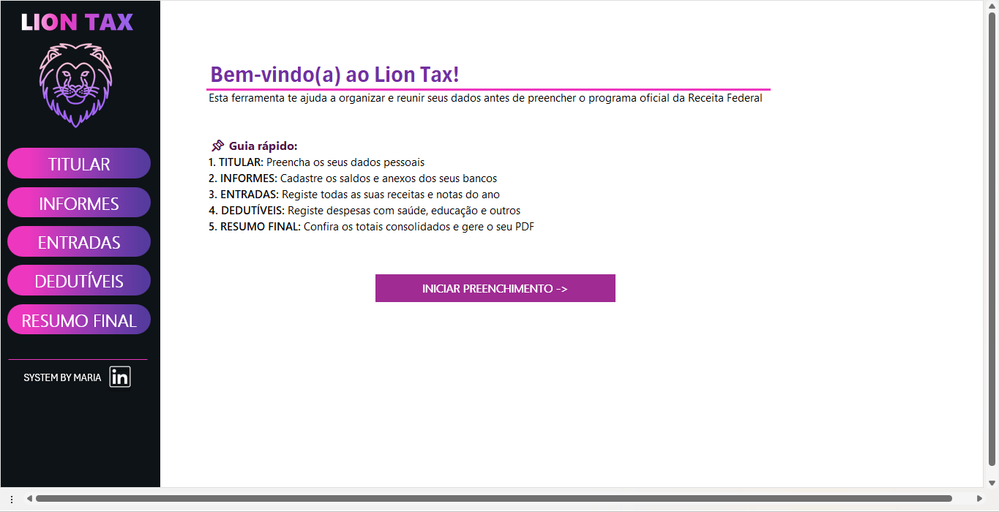
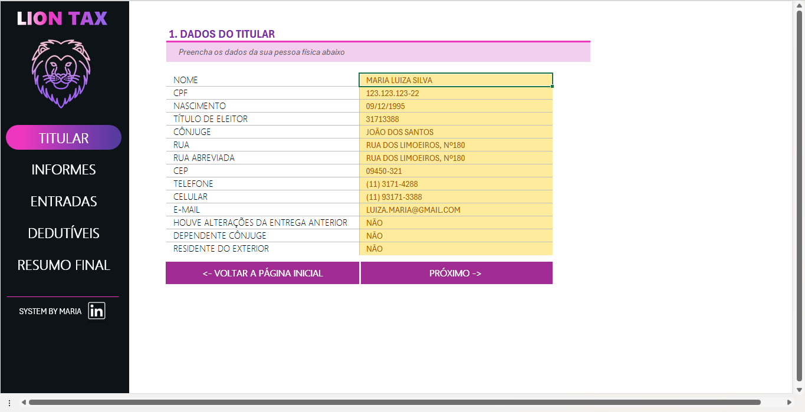
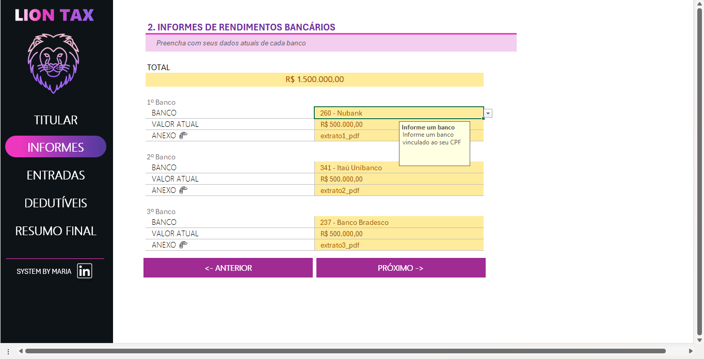
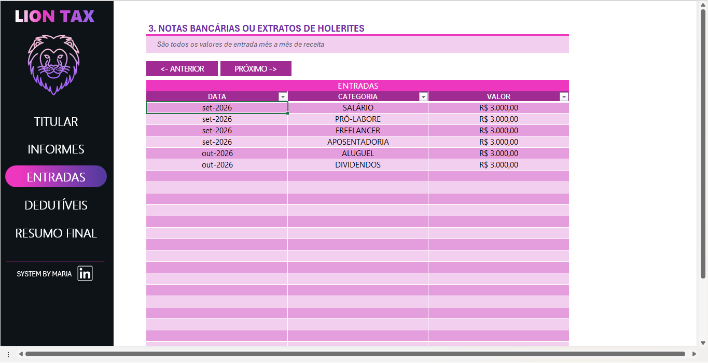
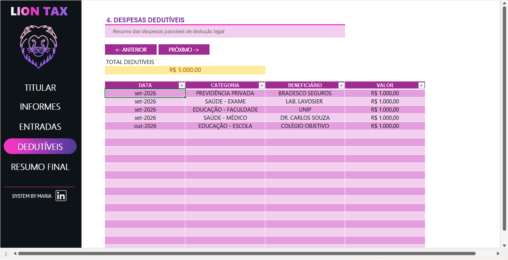
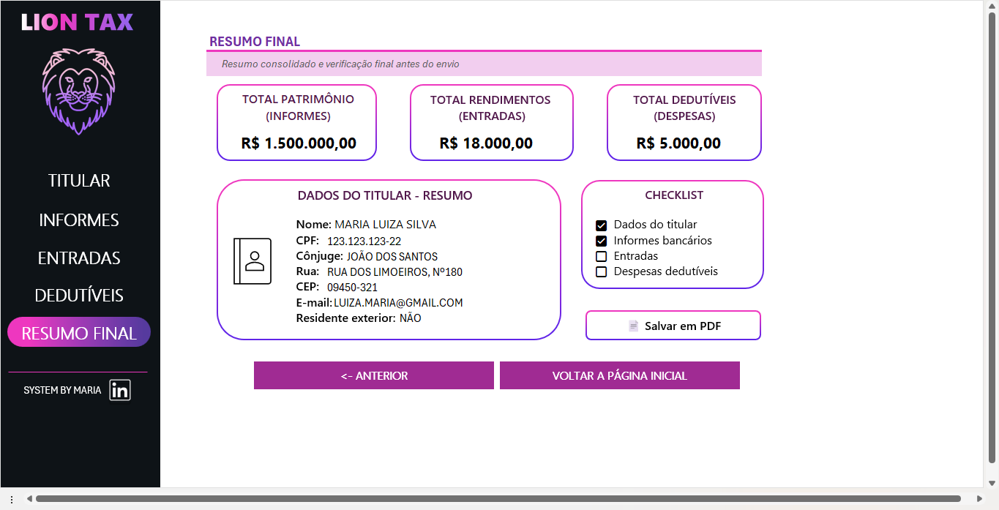

## Lion Tax - Organizador de Dados para Declaração de Imposto de Renda

Projeto desenvolvido no **Bootcamp Santander de Excel + IA**, com o objetivo de aplicar conceitos de Excel na construção de uma ferramenta prática de para reunir e organizar dados necessários para a declaração de imposto de renda.

---

## Sobre o projeto

Na época da declaração de Imposto de Renda, as informações costumam estar espalhadas: informes de rendimentos, dados bancários, documentos pessoais, dependentes e despesas. O **Lion Tax** nasceu para centralizar tudo isso em uma planilha visualmente agradável, com fluxo guiado e controle de preenchimento, pronta para exportar em PDF para enviar ao contador ou consultar na hora de declarar por conta própria.

### Objetivos da ferramenta:
* **Centralização:** Reunir em um só arquivo as informações necessárias para a declaração.
* **Checklist e Controle:** Marcar por meio dos checkboxes o que já foi preenchido e o que ainda falta.
* **Usabilidade:** Permitir navegação simples como um aplicativo, sem exigir conhecimento prévio de Excel.

> ⚠️ **Aviso:** O Lion Tax é uma ferramenta de *organização e gestão de dados*. Ele não calcula imposto e não substitui o programa oficial da Receita Federal nem a orientação de um contador profissional.

---

## Funcionalidades e Destaques

* **Página Inicial com Menu:** Menu de navegação rápido para acessar todas as páginas do projeto.
* **Navegação Intuitiva:** links de navegação no menu principal, além de botões *Anterior* e *Próximo* em cada aba.
* **Campos de Entrada Guiados:** Seções organizadas com validação de dados, mensagens de entrada e alertas de erro (ex: lista suspensa de bancos).
* **Formatação Personalizada:** Máscaras automáticas para CPF, telefone, CEP e valores numéricos.
* **Checkboxes Interativas:** Caixas de seleção para controle de pendências e conferência.
* **Estrutura Protegida:** Apenas as células de preenchimento do usuário ficam liberadas, garantindo que fórmulas e layouts não sejam danificados acidentalmente.
* **Resumo Consolidado Automatizado:** Painel final que busca automaticamente as informações preenchidas nas outras abas.
* **Exportação em PDF com 1 Clique (VBA):** Botão automatizado para exportar o resumo final formatado na horizontal.

---

## Recursos do Excel e VBA Utilizados

| Recurso | Aplicação no Projeto |
| :--- | :--- |
| **Hiperlinks** | links de navegação entre páginas pelo menu e atalho no ícone do LinkedIn |
| **Botões de Navegação** | Botões *Anterior*, *Próximo* e *Voltar a página inicial* em todas as abas |
| **Validação de Dados** | Listas suspensas (ex.: bancos) com mensagens de entrada e erro personalizadas |
| **Formatos Numéricos** | Máscaras de CPF, telefone e CEP |
| **Proteção de Planilha** | Bloqueio de fórmulas e layout, liberando apenas campos de entrada |
| **Referências entre Abas** | Resumo final alimentado dinamicamente pelas abas de preenchimento |
| **Caixas de Seleção (Checkboxes)** | Controle interativo de itens conferidos |
| **Macro VBA (Posicionamento)** | Ajusta dinamicamente a posição dos ícones para conseguir padronizar toda a ferramenta |
| **Macro VBA (PDF)** | Exporta tudo em formato PDF na horizontal |

---

## Estrutura da Ferramenta

1. **Página Inicial:** Apresentação da ferramenta e menu de atalhos.
2. **Páginas de Preenchimento:** tutilar, informes, entradas e despesas.
3. **Resumo Final:** Consolidação das informações e botão para geração do PDF.

---

## Como Usar

1. Baixe o arquivo `Projeto Lion-Tax.xlsm` presente neste repositório.
2. Abra no Microsoft Excel e clique em **"Habilitar Conteúdo / Macros"** (necessário para o funcionamento dos botões e do exportador em PDF).
3. Navegue pelo menu da página inicial ou utilize os botões de navegação.
4. Preencha os campos desbloqueados e marque as checkboxes de conferência.
5. Acesse a guia **Resumo Final** e clique no botão para exportar seu relatório em PDF na horizontal.

 **Privacidade dos Dados:** As informações preenchidas ficam salvas localmente no seu computador. O arquivo disponível neste repositório contém apenas dados para demonstração.

---

## Aprendizados

* **UI/UX em Planilhas:** Como transformar uma planilha comum em uma aplicação visualmente agradável com fluxo guiado estilo app.
* **Proteção Estratégica:** A importância do bloqueio seletivo focado em melhorar a experiência e segurança do usuário.
* **Padronização:** Redução de erros de digitação através de validação de dados e formatos personalizados.
* **Automação com VBA:** Criação de macros funcionais para otimizar tarefas repetitivas de exportação e formatação.

---

👤 **Autora:** Maria Silva | 🎓 **Projeto:** Bootcamp Santander - Excel + IA  

[🔗 Meu LinkedIn](https://www.linkedin.com/in/maria-luiza-leite-silva-/) | [💻 Meu GitHub](https://github.com/mariasilva-sketch)
